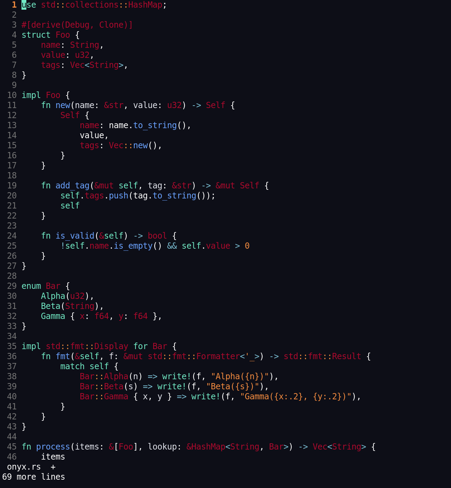

A modern, yet retro, medium-contrast dark colorscheme for Neovim featuring muted plum reds, vibrant mint greens, and crisp blues. Natively optimized for terminal transparency adapting to your favorite terminal's background color.



## Installation

Using **lazy.nvim** — add the following to your Neovim plugin configuration:

```lua
return {
  {
    "kadam-x/onyx-colorscheme",
    lazy = false,
    priority = 1000,
    config = function()
      vim.opt.termguicolors = true
      vim.cmd([[colorscheme onyx]])
    end,
  },
}
```
