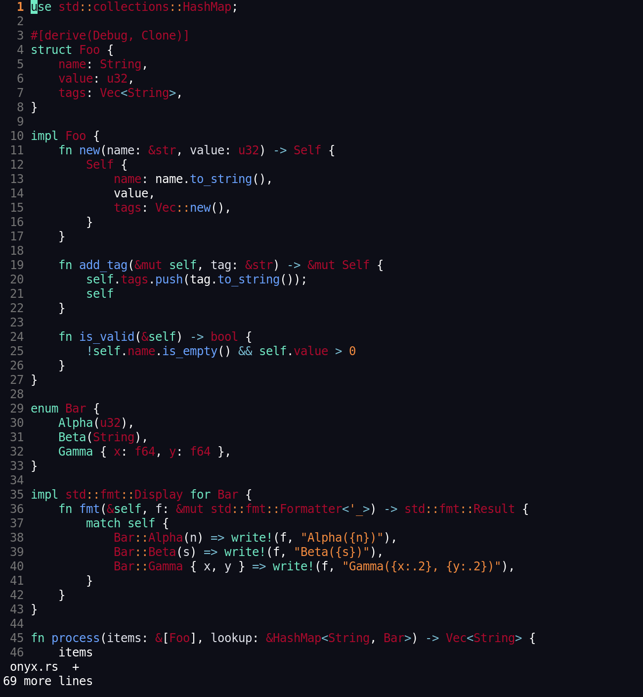

A modern, low-contrast dark colorscheme for Neovim featuring deep charcoal tones, muted plum reds, vibrant mint greens, and crisp infrastructure blues. Natively optimized for terminal transparency.

Installation
Using lazy.nvim
Add the following specification to your Neovim plugin configuration:

Lua
return {
  {
    "kadam-x/onyx-colorscheme",
    lazy = false,    -- Load immediately during startup
    priority = 1000, -- Ensure it initializes before other plugins
    config = function()
      -- Enable 24-bit True Color support
      vim.opt.termguicolors = true
      
      -- Load the colorscheme
      vim.cmd([[colorscheme onyx]])
    end,
  },
}
